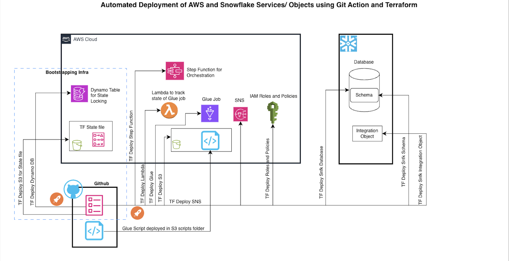
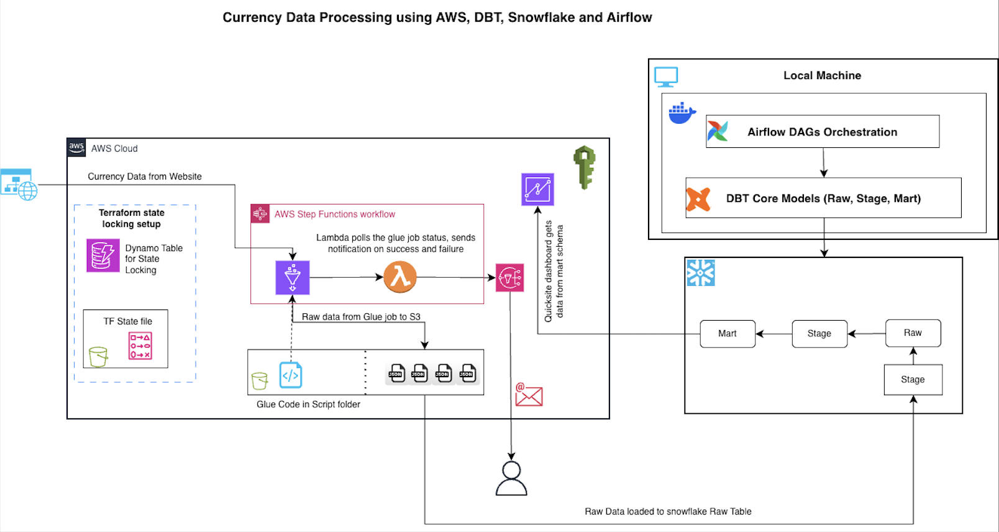

# Capstone Project — Automated Data Engineering Pipeline using AWS, Snowflake, DBT, Airflow, and Terraform

##  [Project Overview](./setup.md)

This **capstone project** focuses on designing a **fully automated, end-to-end data engineering pipeline** that ingests, processes, and visualizes two real-world datasets:

**ExchangeRate.host API** – for global currency conversion.

Students will use **AWS services** (`Glue`, `Step Functions`, `Lambda`, `S3`, `SNS`, `IAM`, `QuickSight`), **Snowflake**, **DBT**, **Airflow**, and **Terraform** for Infrastructure as Code (IaC).
**GitHub Actions** will automate the deployment process.

### By the end of this project, students will have a functioning data platform that can:

* Ingest live and static data from multiple sources
* Transform and load it into **Snowflake**
* Model and aggregate data using **DBT**
* Orchestrate workflows using **Airflow**
* Visualize insights in **QuickSight dashboards**

---

## Phase 1 - Infrastructure

In this phase, students will automate the deployment of all **core AWS and Snowflake components** using **Terraform**, orchestrated via **GitHub Actions**.

###  Key Deliverables

* **DynamoDB** table for Terraform state locking
* **S3** bucket to store Terraform state file
* **IAM Roles and Policies** for service access
* **Glue**, **Lambda**, **SNS**, and **Step Function** creation via Terraform
* **Snowflake objects creation** (Database, Schema, Integration objects)

---

###  [Workflow](./github-workflow.md)

1. Developer pushes Terraform code to GitHub
2. **GitHub Action** triggers `terraform plan` & `terraform apply`
3. AWS infrastructure and Snowflake objects are **provisioned automatically**
4. Terraform state file and locks are **maintained in S3 & DynamoDB**

---

###  [Architecture](./infra-readme.md)

**Automated Deployment using GitHub Actions and Terraform**

---

##  Phase 2 — Currency Data Pipeline

Once the infrastructure is in place, students will create a **data pipeline** to fetch daily currency exchange rates using **AWS Glue** and store the results in **Snowflake**.

###  Source Details

| Parameter          | Description                                                                     |
| ------------------ | ------------------------------------------------------------------------------- |
| **API**            | [https://exchangerate.host](https://exchangerate.host)                          |
| **Authentication** | None required (Free API)                                                        |
| **Purpose**        | Normalize product prices into a common currency (e.g., convert INR → USD → EUR) |
| **Frequency**      | Daily                                                                           |

---

### Flow Summary

1. **AWS Glue** job calls the ExchangeRate API and stores results in **S3 (Raw zone)**
2. **Step Function** orchestrates the pipeline
3. **Lambda Function** monitors Glue job success/failure and triggers **SNS notifications**
4. **DBT Models** load and transform data from:

   * `Raw` → `Stage` → `Mart`
5. **Airflow DAG** orchestrates DBT transformations
6. **QuickSight Dashboard** visualizes 30-day currency trends (e.g., **USD vs EUR**)

---

###  [Architecture](./transform-readme.md)

**Currency Data Processing using AWS, DBT, Snowflake, and Airflow**

---

