# Infrastructure Overview

The **`infra/`** directory defines the complete, automated infrastructure for the **Capstone Currency Data Pipeline**, using **Terraform** to provision and orchestrate both **AWS** and **Snowflake** resources.

It establishes a modular, production-grade foundation for **data ingestion**, **processing**, **notification**, and **analytics integration**, following best practices for separation of concerns and environment consistency.

---

### Core Objective

Provision all infrastructure components required for the **end-to-end data pipeline** that:

1. **Ingests currency exchange data** from external APIs via AWS Glue.
2. **Orchestrates workflow execution** using AWS Step Functions and SNS.
3. **Triggers downstream tasks** via Lambda notifications.
4. **Stores and analyzes data** in Snowflake using a secure AWS–Snowflake integration.

---

## Top-level structure

```
infra/
├── backend.tf
├── bootstrap
│   ├── backend.tf
│   ├── main.tf
│   ├── outputs.tf
│   ├── terraform.tfstate
│   └── variables.tf
├── glue
│   ├── glue.tf
│   ├── output.tf
│   ├── scripts
│   │   └── currency_bootstrap.py
│   └── variables.tf
├── iam
│   ├── glue_role.tf
│   ├── lambda_role.tf
│   ├── outputs.tf
│   ├── sfn_role.tf
│   └── variables.tf
├── lambda
│   ├── deploy
│   │   ├── handler.py
│   │   └── lambda_package.zip
│   ├── lambda.tf
│   └── variables.tf
├── main.tf
├── providers.tf
├── s3
│   ├── main.tf
│   ├── outputs.tf
│   └── variables.tf
├── snowflake
│   ├── main.tf
│   ├── outputs.tf
│   └── variables.tf
├── snowflake_integration
│   ├── main.tf
│   ├── outputs.tf
│   ├── scripts
│   │   └── update_trust.py
│   └── variables.tf
├── sns
│   ├── main.tf
│   └── variables.tf
├── stepfunctions
│   ├── sfn.tf
│   └── variables.tf
├── subscriptions.tf
└── variables.tf
```

---

## Module breakdown — purpose, typical resources, inputs & outputs


## [bootstrap/](./infra/bootstrap/)

Purpose: create foundational Terraform backend resources used by the rest of the infra (S3 bucket for tfstate, DynamoDB table for state locking).

Files:

* `backend.tf` — defines local backend configuration for storing Terraform state.
* `main.tf` — provisions S3 bucket, applies security and lifecycle settings, and creates DynamoDB lock table.
* `outputs.tf` — exposes S3 bucket and DynamoDB table names and ARNs as outputs.
* `variables.tf` — declares input variables for AWS region, state bucket name (unique), and DynamoDB table name.

Typical resources:

* `aws_s3_bucket.tfstate`
* `aws_s3_bucket_public_access_block.tfstate_block`
* `aws_s3_bucket_ownership_controls.tfstate_ownership`
* `aws_s3_bucket_versioning.tfstate_versioning`
* `aws_s3_bucket_server_side_encryption_configuration.tfstate_encryption`
* `aws_s3_bucket_lifecycle_configuration.tfstate_lifecycle`
* `aws_dynamodb_table.tf_lock`

Inputs:

| Name                     |     Type | Description                           |
| ------------------------ | -------: | ------------------------------------- |
| `aws_region`             | `string` | AWS region for backend resources      |
| `tfstate_bucket_name`    | `string` | Bucket name for Terraform state       |
| `tfstate_dynamodb_table` | `string` | DynamoDB table name for state locking |

Outputs:

| Name                  | Description                           |
| --------------------- | ------------------------------------- |
| `tfstate_bucket_name` | S3 bucket name for Terraform state    |
| `tfstate_bucket_arn`  | ARN of the Terraform state bucket     |
| `dynamodb_table_name` | DynamoDB table name for state locking |

> Note: `terraform.tfstate` should be ignored in local — use remote backend as the source of truth.

**Bucket:**

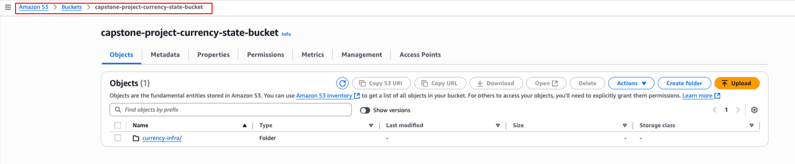

**DynamoDB:**

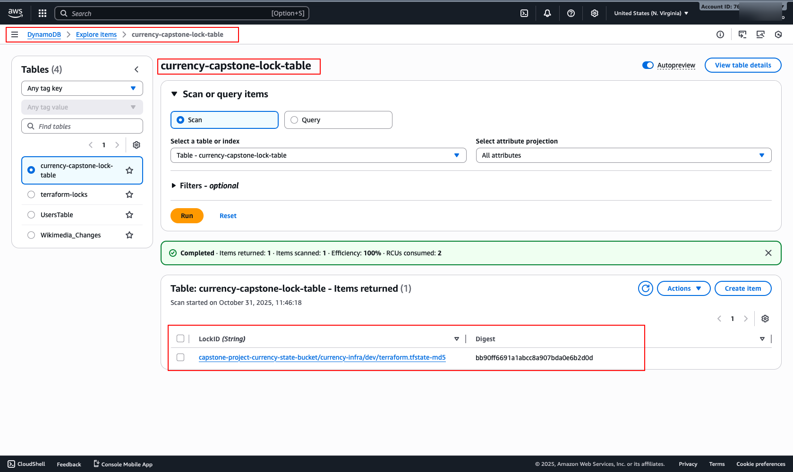


---

## [s3/](./infra/s3/)

**Purpose:** create the data S3 bucket for raw, processed, and archived data with security controls, versioning, server-side encryption, lifecycle policies, and standard prefixes.

**Files:**

* `main.tf` — provisions the S3 bucket, applies access restrictions, ownership controls, versioning, encryption, and lifecycle policies for `raw/` prefix.
* `outputs.tf` — exports the bucket name, bucket ARN, and common S3 prefixes.
* `variables.tf` — defines input variables for region, project, environment, bucket configuration, and lifecycle settings.

**Typical resources:**

* `aws_s3_bucket.data`
* `aws_s3_bucket_public_access_block.data_block`
* `aws_s3_bucket_ownership_controls.data_ownership`
* `aws_s3_bucket_versioning.data_versioning`
* `aws_s3_bucket_server_side_encryption_configuration.data_encryption`
* `aws_s3_bucket_lifecycle_configuration.data_lifecycle_raw`
* `local.prefixes`

**Inputs:**

| Name                  |     Type | Default               |
| --------------------- | -------: | --------------------- |
| `aws_region`          | `string` | `"us-east-1"`         |
| `project`             | `string` | `"capstone-currency"` |
| `env`                 | `string` | `"dev"`               |
| `bucket_name`         | `string` | *(required)*          |
| `force_destroy`       |   `bool` | `true`                |
| `raw_transition_days` | `number` | `30`                  |
| `noncurrent_days`     | `number` | `90`                  |
| `raw_expiration_days` | `number` | `365`                 |

**Outputs:**

| Name          | Description                            |
| ------------- | -------------------------------------- |
| `bucket_name` | Name of the data S3 bucket             |
| `bucket_arn`  | ARN of the data S3 bucket              |
| `s3_prefixes` | Common prefixes defined for the bucket |

**Bucket:**

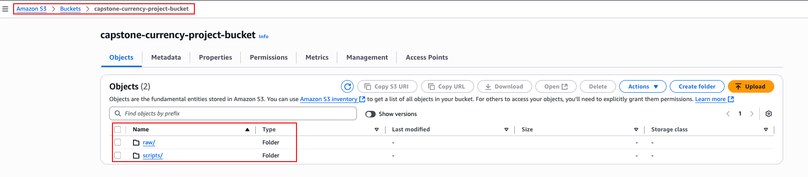

**Bucket ARN:**

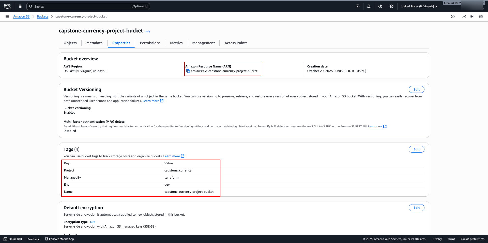


---

## [iam/](./infra/iam/)

Purpose: create IAM roles, policies, and attachments for Glue, Lambda, and Step Functions with scoped permissions.

Files:

* `glue_role.tf` — defines Glue assume role, S3 read/write policy, CloudWatch logs policy, and attachments.
* `lambda_role.tf` — defines Lambda assume role, attaches AWSLambdaBasicExecutionRole, and an inline policy for SSM/SNS/SecretsManager.
* `sfn_role.tf` — defines Step Functions assume role and policy to start/poll Glue jobs, invoke Lambda, and publish to SNS.
* `variables.tf` — declares module inputs (project, env, s3_bucket_arn, lambda_function_arn, glue_job_name, aws_region).
* outputs declared at module root — exports role ARNs.

Typical resources:

* `data.aws_iam_policy_document.glue_assume`

* `aws_iam_role.glue_role`

* `aws_iam_policy.glue_s3_policy`

* `aws_iam_role_policy_attachment.glue_attach_s3`

* `aws_iam_policy.glue_logs`

* `aws_iam_role_policy_attachment.glue_attach_logs`

* `data.aws_iam_policy_document.lambda_assume`

* `aws_iam_role.lambda_role`

* `aws_iam_role_policy_attachment.lambda_basic_exec`

* `aws_iam_policy.lambda_extra`

* `aws_iam_role_policy_attachment.lambda_extra_attach`

* `data.aws_iam_policy_document.sfn_assume`

* `aws_iam_role.sfn_role`

* `aws_iam_policy.sfn_policy`

* `data.aws_caller_identity.current`

* `data.aws_region.current`

* `aws_iam_role_policy_attachment.sfn_attach_policy`

Inputs:

| Name                  |     Type | Default               | Description                                                       |
| --------------------- | -------: | --------------------- | ----------------------------------------------------------------- |
| `project`             | `string` | `"capstone-currency"` | Project name used in resource names                               |
| `env`                 | `string` | `"dev"`               | Environment tag                                                   |
| `s3_bucket_arn`       | `string` |                       | ARN of data S3 bucket (used to scope Glue S3 policy)              |
| `lambda_function_arn` | `string` | `"*"`                 | Lambda ARN for Step Functions invoke (can be `*` temporarily)     |
| `glue_job_name`       | `string` | `""`                  | Glue job name to scope Step Functions Glue permissions (optional) |
| `aws_region`          | `string` | `""`                  | AWS region used to build Glue ARN when scoping                    |

Outputs:

| Name              | Description                        |
| ----------------- | ---------------------------------- |
| `glue_role_arn`   | ARN of the Glue IAM role           |
| `sfn_role_arn`    | ARN of the Step Functions IAM role |
| `lambda_role_arn` | ARN of the Lambda IAM role         |

**Roles:**

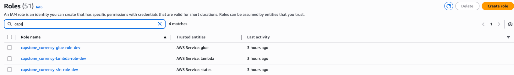

---

## [glue/](./infra/glue/)

**Purpose:** define and deploy the AWS Glue job responsible for ingesting currency exchange rate data from `exchangerate.host`, uploading raw JSON chunks to S3, and maintaining modular script structure for reuse and versioning.

**Files:**

* `glue.tf` — creates the S3 object for the bootstrap script and provisions the Glue Python Shell job (`aws_glue_job.currency`).
* `scripts/currency_bootstrap.py` — bootstrap script executed by the Glue job; fetches monthly currency data from the exchangerate.host API, handles chunking by month, retries transient failures, and uploads JSON results to partitioned S3 paths (`year=YYYY/month=MM`).
* `outputs.tf` — exports Glue job name and the S3 path of the bootstrap script.
* `variables.tf` — defines variables for bucket name, Glue role ARN, job name, capacity, and Glue version.

**Typical resources:**

* `aws_s3_object.bootstrap_script`
* `aws_glue_job.currency`
* `local.scripts_prefix`
* `local.bootstrap_key`

**Inputs:**

| Name            |     Type | Description                                            |
| --------------- | -------: | ------------------------------------------------------ |
| `bucket_name`   | `string` | S3 bucket name to upload scripts and store output data |
| `project`       | `string` | Project name for tagging                               |
| `env`           | `string` | Environment tag (e.g., dev, prod)                      |
| `job_name`      | `string` | Name of the Glue job                                   |
| `glue_role_arn` | `string` | IAM role ARN with Glue permissions                     |
| `max_capacity`  | `number` | Maximum capacity (DPUs) for the Glue job . `PythonShell` jobs do not use `Apache Spark`. It does not require distributed compute, so giving it a full DPU is unnecessary.             |
| `glue_version`  | `string` | Glue version to run the job (e.g., 3.0)                |

**Outputs:**

| Name                | Description                                                                                 |
| ------------------- | ------------------------------------------------------------------------------------------- |
| `glue_job_name`     | Name of the Glue job (`aws_glue_job.currency.name`)                                         |
| `bootstrap_s3_path` | S3 path of the uploaded bootstrap script (`s3://${var.bucket_name}/${local.bootstrap_key}`) |

**Glue Job:** 

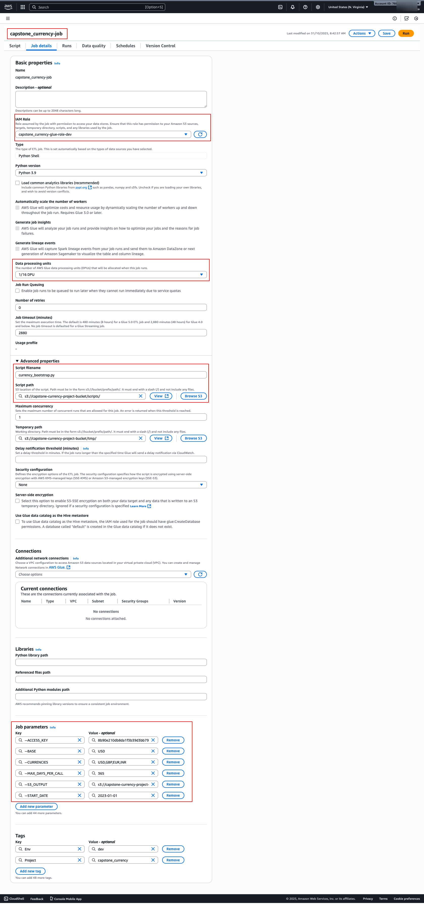

**Versioned Glue Job Script**

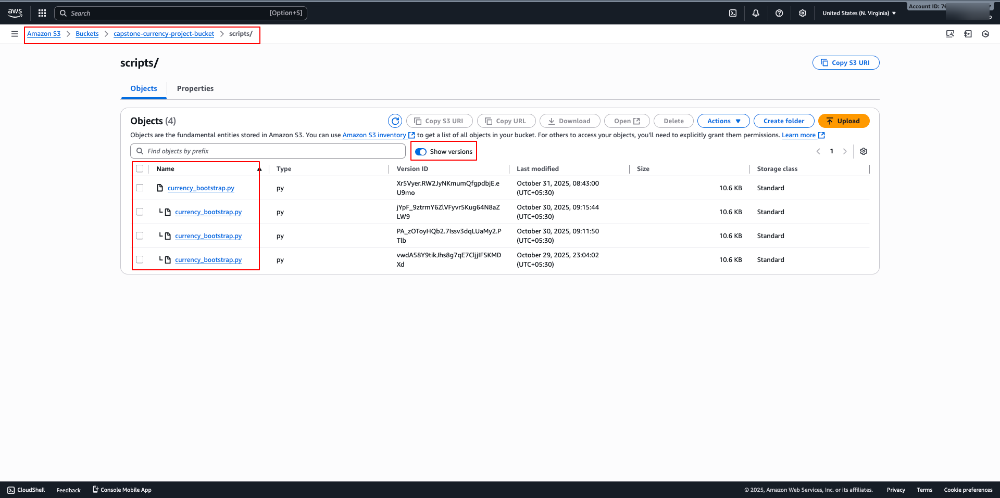

---

## [lambda/](./infra/lambda/)

**Purpose:** deploy the post-ingest Lambda (SNS subscriber) that processes Glue job notifications and can trigger downstream tasks.

**Files:**

* `deploy/handler.py` — Lambda handler (SNS subscriber / direct invoke) that parses events, logs, and triggers downstream actions.
* `deploy/lambda_package.zip` — packaged Lambda code (built from `deploy/` or created by `archive_file`).
* `lambda.tf` — packages the `deploy/` directory into a ZIP and creates the `aws_lambda_function.post_ingest`.
* `variables.tf` — declares inputs for project, env, role ARN, bucket, SNS topic, function name, and runtime.

**Typical resources:**

* `data.archive_file.lambda_zip`
* `aws_lambda_function.post_ingest`

**Inputs:**

| Name                   |     Type | Default                      |
| ---------------------- | -------: | ---------------------------- |
| `project`              | `string` | `"capstone-currency"`        |
| `env`                  | `string` | `"dev"`                      |
| `lambda_role_arn`      | `string` | *(required)*                 |
| `bucket_name`          | `string` | *(required)*                 |
| `sns_topic_arn`        | `string` | `""`                         |
| `lambda_function_name` | `string` | `"capstone-currency-lambda"` |
| `runtime`              | `string` | `"python3.12"`               |

**Outputs:**

| Name                   | Description                                                            |
| ---------------------- | ---------------------------------------------------------------------- |
| `lambda_function_name` | Lambda function name (`aws_lambda_function.post_ingest.function_name`) |
| `lambda_function_arn`  | Lambda function ARN (`aws_lambda_function.post_ingest.arn`)            |

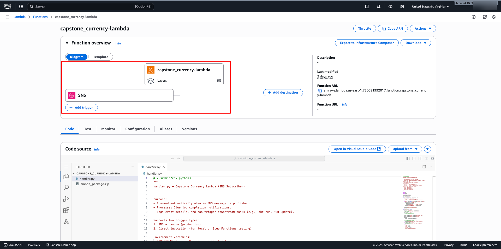

---

## [sns/](./infra/sns/)

**Purpose:** create an SNS topic for Glue job success/failure notifications and optionally subscribe email recipients.

**Files:**

* `main.tf` — defines the SNS topic, creates optional email subscriptions, and exports topic details.
* `variables.tf` — declares input variables for project, environment, and alert email list.

**Typical resources:**

* `aws_sns_topic.alerts`
* `aws_sns_topic_subscription.email_subs`

**Inputs:**

| Name           |           Type | Default               |
| -------------- | -------------: | --------------------- |
| `project`      |       `string` | `"capstone-currency"` |
| `env`          |       `string` | `"dev"`               |
| `alert_emails` | `list(string)` | `[]`                  |

**Outputs:**

| Name             | Description                             |
| ---------------- | --------------------------------------- |
| `sns_topic_name` | Name of the SNS topic for notifications |
| `sns_topic_arn`  | ARN of the SNS topic for notifications  |

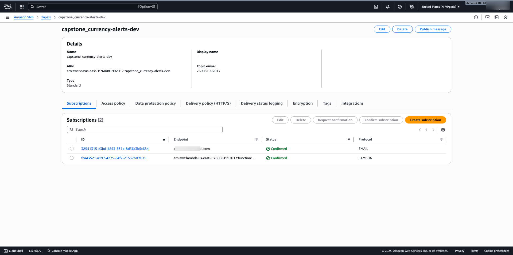

---

## [stepfunctions/](./infra/stepfunctions/)

**Purpose:** start the Glue job, poll until completion, and publish structured success/failure messages to SNS.

**Files:**

* `sfn.tf` — defines the Step Functions state machine JSON, creates `aws_sfn_state_machine.glue_sm`.
* `variables.tf` — declares inputs for project, env, glue job, role ARN, SNS topic, poll interval, and max attempts.

**Typical resources:**

* `local.sfn_def`
* `aws_sfn_state_machine.glue_sm`

**Inputs:**

| Name                    |     Type | Default               |
| ----------------------- | -------: | --------------------- |
| `project`               | `string` | `"capstone-currency"` |
| `env`                   | `string` | `"dev"`               |
| `glue_job_name`         | `string` | *(required)*          |
| `sfn_role_arn`          | `string` | *(required)*          |
| `sns_topic_arn`         | `string` | *(required)*          |
| `poll_interval_seconds` | `number` | `20`                  |
| `max_attempts`          | `number` | `150`                 |

**Outputs:**

| Name       | Description                                                                     |
| ---------- | ------------------------------------------------------------------------------- |
| `sfn_arn`  | ARN of the Step Functions state machine (`aws_sfn_state_machine.glue_sm.arn`)   |
| `sfn_name` | Name of the Step Functions state machine (`aws_sfn_state_machine.glue_sm.name`) |

**step-function**

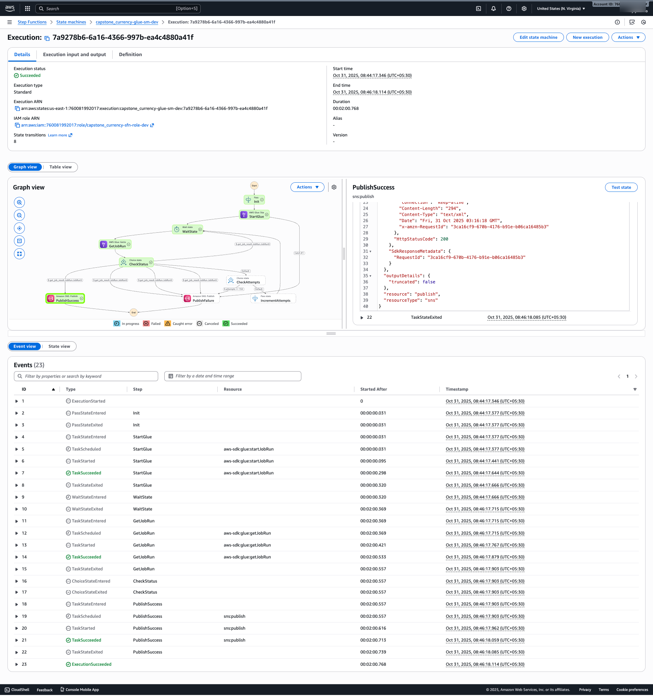

---

## [snowflake/](./infra/snowflake/)

**Purpose:** provision Snowflake database and schema for the project.

**Files:**

* `main.tf` — provider requirement and resources `snowflake_database.this` and `snowflake_schema.this`.
* `outputs.tf` — exports `snowflake_database`, `snowflake_schema`, and `granted_role`.
* `variables.tf` — declares Snowflake connection and naming inputs.

**Typical resources:**

* `snowflake_database.this`
* `snowflake_schema.this`

**Inputs:**

| Name                          |     Type | Default                                    | Description                                                      |
| ----------------------------- | -------: | ------------------------------------------ | ---------------------------------------------------------------- |
| `project_prefix`              | `string` | `"capstone_currency"`                      | Prefix used to derive DB/schema names when not provided          |
| `snowflake_organization_name` | `string` |                                            | Snowflake organization name                                      |
| `snowflake_account_name`      | `string` |                                            | Snowflake account name                                           |
| `snowflake_user`              | `string` |                                            | Snowflake user for Terraform                                     |
| `snowflake_password`          | `string` |                                            | Snowflake user password (sensitive)                              |
| `snowflake_role`              | `string` | `"SYSADMIN"`                               | Role to use for provisioning                                     |
| `snowflake_warehouse`         | `string` | `"COMPUTE_WH"`                             | Warehouse to use                                                 |
| `database_name`               | `string` | `""`                                       | Optional database name (derived from `project_prefix` if empty)  |
| `database_comment`            | `string` | `"Database for CAPSTONE-CURRENCY project"` | Comment for the database                                         |
| `schema_name`                 | `string` | `""`                                       | Optional schema name (derived from `project_prefix` if empty)    |
| `schema_comment`              | `string` | `"Schema for CAPSTONE-CURRENCY project"`   | Comment for the schema                                           |
| `grant_role`                  | `string` | `""`                                       | Account role to grant USAGE on DB & schema (leave empty to skip) |

**Outputs:**

| Name                 | Description                                       |
| -------------------- | ------------------------------------------------- |
| `snowflake_database` | Created Snowflake database name                   |
| `snowflake_schema`   | Created Snowflake schema name                     |
| `granted_role`       | Role that received USAGE grants (or null if none) |

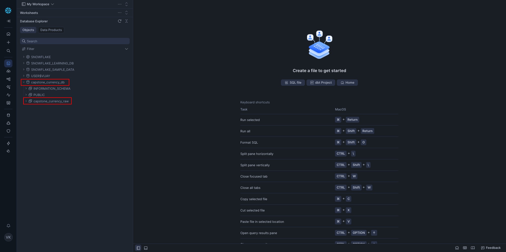

---

## [snowflake_integration/](./infra/snowflake_integration/)

**Purpose:** create IAM role + policy for Snowflake S3 access, provision Snowflake storage integration, and tighten role trust using Snowflake-generated IAM principal/external-id.

**Files:**

* `main.tf` — builds S3 read policy, IAM role, role-policy attachment, `snowflake_storage_integration.capstone`, and `null_resource.tighten_trust` that runs the trust update script.
* `outputs.tf` — exports role ARN, allowed S3 location, Snowflake IAM user ARN, and external ID.
* `variables.tf` — declares inputs for S3 bucket/prefix, integration/role names, Snowflake AWS account id, project, and update script path.
* `scripts/update_trust.py` — local helper that updates the IAM role assume-policy to restrict trust to Snowflake principal + ExternalId.

**Typical resources:**

* `data.aws_iam_policy_document.s3_read`
* `aws_iam_policy.snowflake_s3_read`
* `aws_iam_role.snowflake_integration`
* `aws_iam_role_policy_attachment.attach_read`
* `snowflake_storage_integration.capstone`
* `null_resource.tighten_trust`

**Inputs:**

| Name                       |     Type | Default                                    |
| -------------------------- | -------: | ------------------------------------------ |
| `s3_bucket`                | `string` |                                            |
| `s3_prefix`                | `string` | `""`                                       |
| `integration_name`         | `string` | `"capstone_snowflake_s3_integration"`      |
| `iam_role_name`            | `string` | `"capstone_snowflake_s3_integration_role"` |
| `snowflake_aws_account_id` | `string` | `"898466741470"`  `"This can be different for you, update it"`                       |
| `project`                  | `string` | `"capstone-currency"`                      |
| `database_comment`         | `string` | `""`                                       |
| `schema_comment`           | `string` | `""`                                       |
| `update_trust_script`      | `string` | `""`                                       |

> **Note:** Ensure the IAM role’s trust policy allows the Snowflake AWS principal (with the correct External ID) to assume the role for S3 access.

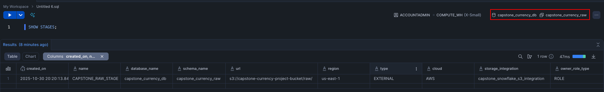

**Outputs:**

| Name                             | Description                                             |
| -------------------------------- | ------------------------------------------------------- |
| `snowflake_integration_role_arn` | IAM role ARN for Snowflake to assume                    |
| `s3_allowed_location`            | S3 path Snowflake can access (`s3://<bucket>/<prefix>`) |
| `sf_storage_iam_user_arn`        | Snowflake-generated IAM user ARN (if available)         |
| `sf_storage_external_id`         | Snowflake-generated external ID (if available)          |

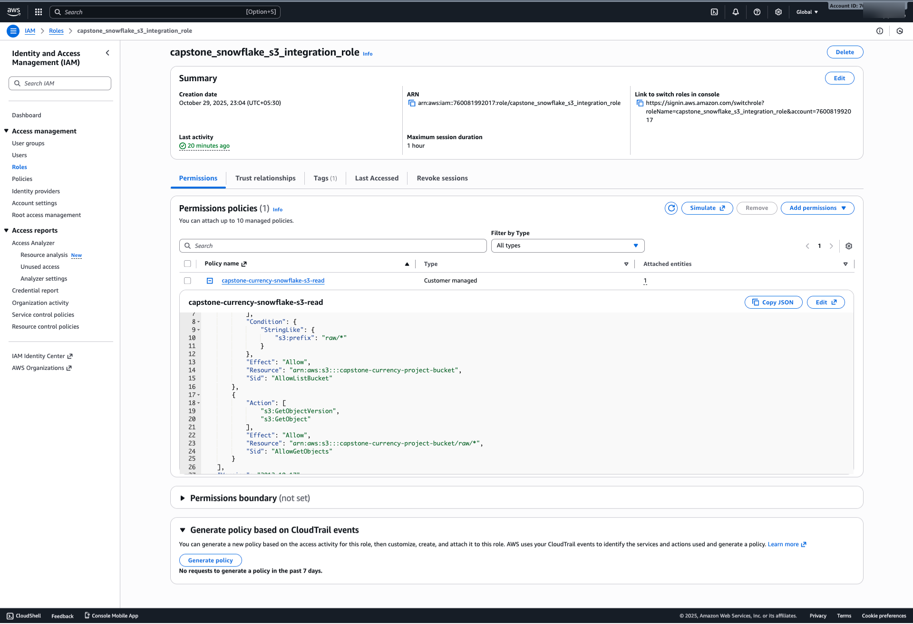

**S3 Snowflake Trust Policy**

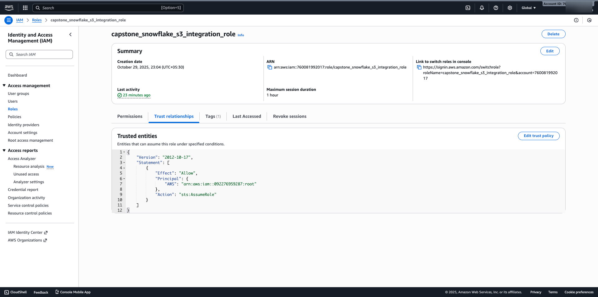

---

## [infra/](./infra/) (root)

**Purpose:** orchestrate all Terraform submodules — provisioning AWS (S3, IAM, Glue, Lambda, Step Functions, SNS) and Snowflake resources, with backend and provider configuration.

**Files:**

* `main.tf` — central orchestration wiring all modules with dependency ordering.
* `providers.tf` — defines AWS and Snowflake providers and their configuration.
* `subscriptions.tf` — connects SNS topic to Lambda and grants SNS invoke permission.
* `variables.tf` — declares global variables shared by all modules (project, env, region, Snowflake credentials).
* `backend.tf` — configures Terraform remote backend (S3 + DynamoDB) created via `bootstrap`.

**Typical modules:**

* `module.s3` — creates S3 data bucket.
* `module.iam` — provisions IAM roles and policies.
* `module.glue` — sets up Glue job and bootstrap script.
* `module.sns` — defines alert topic and subscriptions.
* `module.lambda` — deploys post-ingest Lambda function.
* `module.stepfunctions` — orchestrates Glue job execution and publishes status to SNS.
* `module.snowflake` — provisions Snowflake database and schema.
* `module.snowflake_integration` — configures Snowflake ↔︎ S3 storage integration and trust policy.

**Inputs:**

| Name                          |           Type | Default                              | Description                            |
| ----------------------------- | -------------: | ------------------------------------ | -------------------------------------- |
| `project`                     |       `string` | `"capstone_currency"`                | Project name for tags and naming       |
| `env`                         |       `string` | `"dev"`                              | Environment name                       |
| `aws_region`                  |       `string` | `"us-east-1"`                        | AWS region                             |
| `aws_profile`                 |       `string` | `""`                                 | AWS CLI profile (optional)             |
| `data_bucket_name`            |       `string` | `"capstone-currency-project-bucket-<your-name>"` | Primary S3 bucket for data and scripts |
| `alert_emails`                | `list(string)` | `["youremail@gmail.com"]`          | Email addresses for SNS notifications  |
| `snowflake_organization_name` |       `string` | `""`                                 | Snowflake organization name            |
| `snowflake_account_name`      |       `string` | `""`                                 | Snowflake account name or locator      |
| `snowflake_user`              |       `string` | `""`                                 | Snowflake user used by Terraform       |
| `snowflake_password`          |       `string` | `""`                                 | Snowflake user password (sensitive)    |
| `snowflake_role`              |       `string` | `"ACCOUNTADMIN"`                     | Snowflake role                         |
| `snowflake_warehouse`         |       `string` | `"CAPSTONE_WH"`                      | Warehouse to use or create             |
| `snowflake_region`            |       `string` | `""`                                 | Optional Snowflake region override     |

**Backend configuration:**

* **Type:** `s3`
* **Bucket:** `capstone-project-currency-state-<unique-name>`
* **Key:** `currency-infra/dev/terraform.tfstate`
* **Region:** `us-east-1`
* **DynamoDB Table:** `currency-capstone-lock-table`
* **Encryption:** enabled (`encrypt = true`)

**Notes:**

* Dependencies ensure correct creation order (e.g., IAM after S3, Glue after IAM, Step Functions after all).
* Snowflake credentials should be provided securely (via CI/CD secrets or Terraform Cloud variables).
* The `backend.tf` relies on resources created in `infra/bootstrap`.

**Terraform State File**

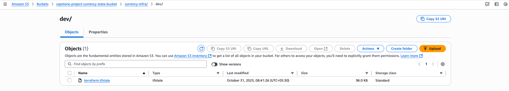

---
**[Back](./README.md)**
