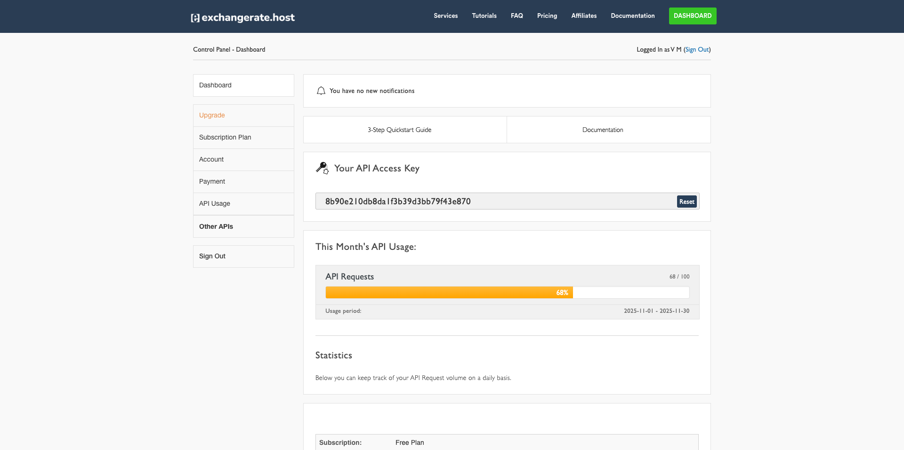
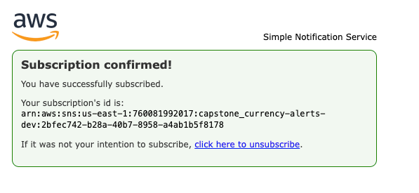
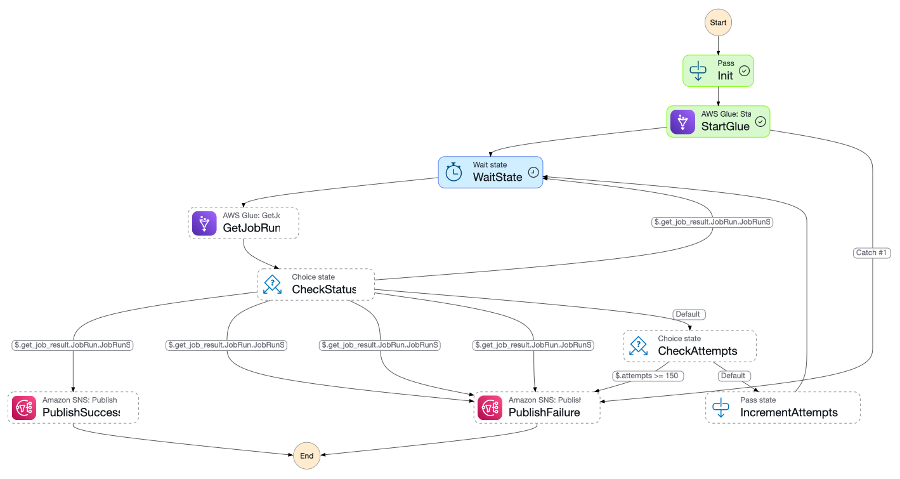
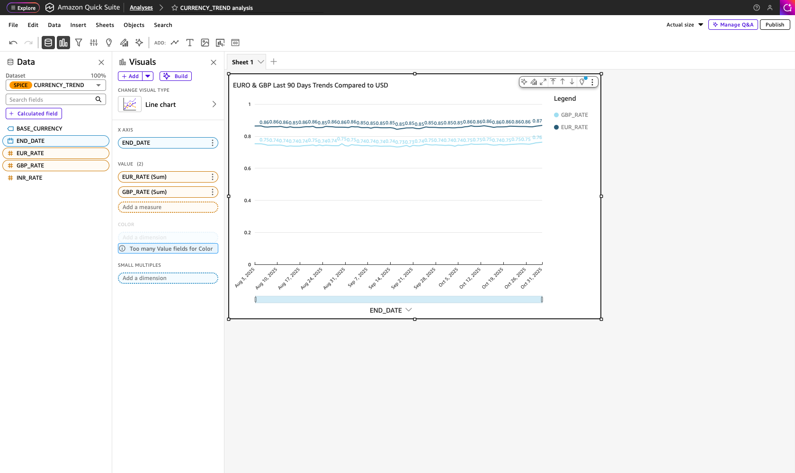
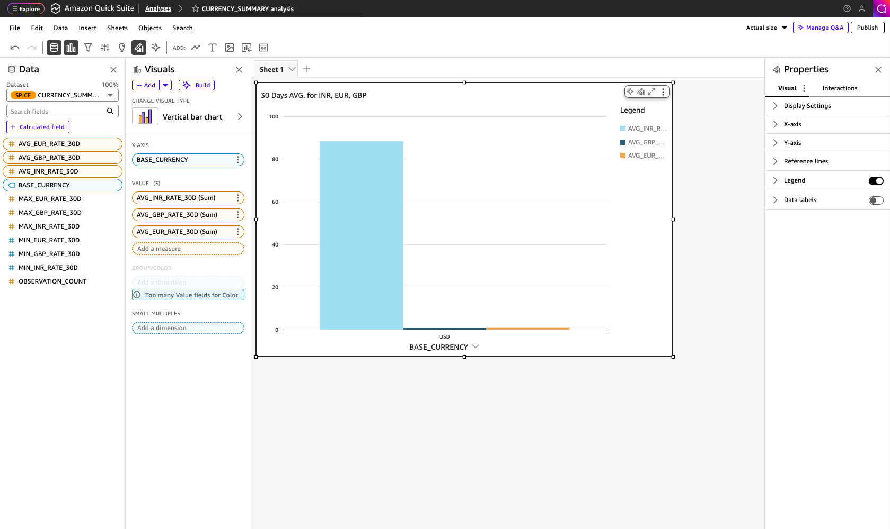

# Currency Capstone

End-to-end setup guide for the **Currency Capstone** project.
All provisioning and orchestration are handled through **GitHub Actions CI** using **Terraform**.
Only two manual actions are required:

1. Confirm the **SNS subscription email**.
2. Provide the **ExchangeRate.host API access key** as a secret.

---

## 1. Prerequisites

Before triggering any workflow:

1. **ExchangeRate.host account**

   * Sign up at [https://exchangerate.host/dashboard](https://exchangerate.host/dashboard)
   * Obtain your free `ACCESS_KEY`.

   

2. **AWS IAM user / role**

   * Used by GitHub Actions to run Terraform.
   * Must have permissions for:

     * `AmazonS3FullAccess`
     * `AWSGlueServiceRole`
     * `AWSLambda_FullAccess`
     * `AWSStepFunctionsFullAccess`
     * `AmazonSNSFullAccess`
     * `IAMFullAccess` *(for initial setup only)*
   * Configure AWS credentials in your CI secrets.

3. **Snowflake trial or dev account**

   * Required for the Terraform Snowflake module and dbt models.
   * Save account details and credentials as CI secrets.

---

## 2. CI Workflows

All infrastructure is deployed, orchestrated, and destroyed through these CI workflows under `.github/workflows/`.

| Workflow                    | Purpose                                                               | Trigger                                        |
| --------------------------- | --------------------------------------------------------------------- | ---------------------------------------------- |
| **terraform-bootstrap.yml** | Creates the Terraform remote state S3 bucket and DynamoDB lock table. | **Manual trigger** from GitHub Actions (once). |
| **terraform-infra.yml**     | Deploys full AWS and Snowflake infrastructure.                        | Triggered after bootstrap completes.           |
| **terraform-destroy.yml**   | Tears down all resources.                                             | Manual trigger when cleanup is required.       |

Each workflow reads credentials and variables from repository secrets.

---

## 3. AWS Side

### 3.1 SNS Subscription (manual)

After **[terraform-infra.yml](./.github/workflows/terraform-infra.yml)** runs, AWS sends a **subscription confirmation email** to the address defined in Terraform.
Open the email and click **Confirm Subscription**.

> This is the only required manual action on AWS.



---

### 3.2 Define a Globally Unique Bucket Name (Prerequisite)

Before deploying the infrastructure, you must define a globally unique S3 bucket name that will store:

- Terraform State file
- Currency Raw Data
- Glue ETL script
- Temporary/intermediate artifacts

S3 bucket names must be unique across all AWS accounts and regions, and follow DNS-compliant naming rules.

**Where to update.**

| Terraform File                        | Variable name     |
| ----------------------------- | ----------------- |
| **[bootstrap](./infra/bootstrap/variables.tf)** | `tfstate_bucket_name`           |
| **[backend](./infra/backend.tf)**      | `backend "s3"` should same that created via bootstrap        |
| **[variables](./infra/variables.tf)**              | `data_bucket_name`   |

---

### 3.3 Step Function → Glue Job

The Step Function orchestrates the Glue ETL job (`currency_bootstrap.py`).
It must receive parameters in the following JSON structure:

```json
{
  "script_s3": "s3://capstone-currency-project-bucket-<your-name>/scripts/currency_bootstrap.py",
  "arguments": {
    "--S3_OUTPUT": "s3://capstone-currency-project-bucket-<your-name>/raw/",
    "--START_DATE": "2025-05-01",
    "--END_DATE": "TODAY",
    "--CURRENCIES": "USD,GBP,EUR,INR",
    "--ACCESS_KEY": "d855d8f59a9b9282283cd86ed533397c",
    "--MAX_DAYS_PER_CALL": "365",
    "--TempDir": "s3://capstone-currency-project-bucket/temp/"
  },
  "metadata": { "triggered_by": "manual" }
}
```



This payload is passed automatically from CI or can be used manually for ad-hoc runs.

---

## 4. Snowflake Side

If Snowflake integration objects already exist or need to be recreated manually, run the following SQL commands in Snowflake.
These steps are **only required if Terraform integration fails**.

```sql
--Drop old integration (only if conflict exists)
--DROP INTEGRATION "capstone_snowflake_s3_integration";

DESC INTEGRATION "capstone_snowflake_s3_integration";

-- 2. Create JSON file format
CREATE OR REPLACE FILE FORMAT capstone_json_format
TYPE = 'JSON'
COMMENT = 'JSON file format for capstone raw files';

-- 3. Create external stage pointing to S3
CREATE OR REPLACE STAGE capstone_raw_stage
URL = 's3://capstone-currency-project-bucket/raw/'
STORAGE_INTEGRATION = capstone_snowflake_s3_integration
FILE_FORMAT = capstone_json_format;

SHOW STAGES;

-- 4. Create external table for raw JSON data
CREATE OR REPLACE EXTERNAL TABLE CAPSTONE_CURRENCY_RAW_TABLE (
  raw_data VARIANT AS (TRY_PARSE_JSON($1))
)
WITH LOCATION = @capstone_raw_stage
FILE_FORMAT = (FORMAT_NAME = capstone_json_format)
AUTO_REFRESH = FALSE;

-- 5. Refresh metadata
ALTER EXTERNAL TABLE CAPSTONE_CURRENCY_RAW_TABLE REFRESH;
```

> After running these commands, the Snowflake external table will expose the JSON objects ingested by Glue from the S3 `raw/` folder.

---

## 5. Amazon QuickSight — BI Integration (from Snowflake)

Here’s the **complete and simple flow** — from connecting Snowflake to **analyzing data** in **QuickSight**:

---

### **5.1. Add Snowflake Dataset**

1. Open **Amazon QuickSight**.
2. Go to **Datasets → New dataset**.
3. Choose **Snowflake**.
4. Enter:

   * **Data source name**
   * **Server**: your Snowflake account URL (no `https://`)
   * **Warehouse**, **Database**, **Schema**
   * **Username** and **Password**
5. Click **Create data source**.
6. Select a **table** or enter a **custom SQL query**.
7. Click **Select → Edit/Preview data → Save & visualize**.


---

### **5.2. Analyze the Data**

**Steps to Create a Currency Trend Chart**

1. Go to **Analyses → New analysis** in QuickSight.
2. Select your dataset (e.g., `CURRENCY_TREND`).
3. Click **+ Add → Add visual** and choose **Line chart**.
4. Drag fields:

   * **END_DATE** → *X-axis*
   * **EUR_RATE** and **GBP_RATE** → *Value*
5. (Optional) Rename the chart title →
   *“EURO & GBP Last 90 Days Trends Compared to USD.”*
6. Turn on **Legend** and **Data labels** from the **Properties** panel.
7. Adjust date range or format as needed.
8. Click **Save analysis** or **Publish dashboard**.



---

### **Steps to Create 30-Day Average Currency Summary**

1. Open **QuickSight → Analyses → New analysis**.
2. Select your dataset (e.g., `CURRENCY_SUMMARY`).
3. Click **+ Add → Add visual** and choose **Vertical bar chart**.
4. Drag these fields:

   * **BASE_CURRENCY** → *X-axis*
   * **AVG_INR_RATE_30D**, **AVG_GBP_RATE_30D**, **AVG_EUR_RATE_30D** → *Value*
5. (Optional) Rename the title →
   *“30 Days AVG for INR, EUR, GBP.”*
6. Turn on **Legend** from the **Properties** panel (right side).
7. Optionally enable **Data labels** or adjust axis settings.
8. Click **Save analysis** or **Publish dashboard** when done.



---

### **5.3. Save and Share**

1. Click **Save analysis**.
2. To share, click **Share → Dashboard**.
3. Choose users or groups to publish your dashboard.

---

## 6. CI Destroy Workflow

`.github/workflows/terraform-destroy.yml`
Tears down all AWS and Snowflake resources created by the project.

Run this workflow from GitHub Actions when cleanup is required.
Terraform automatically deletes resources in dependency order.

---

## 7. Execution Sequence Summary

1. Complete all **prerequisites**:

   * ExchangeRate.host access key
   * AWS IAM user with permissions
   * Snowflake trial account and credentials

2. In GitHub Actions:

   * Run **terraform-bootstrap.yml** manually (creates state backend).
   * Run **terraform-infra.yml** (provisions full infrastructure).

3. Confirm the **SNS email subscription**.

4. Trigger the **Step Function** with the JSON payload (manual or CI).
   This starts the Glue ETL job and writes raw data to S3.

5. (Optional) If Terraform integration fails, execute the **Snowflake SQL** block above.

6. Use **Amazon QuickSight** to connect to Snowflake and build dashboards from `currency_trend` and `currency_summary` views.

7. Use **terraform-destroy.yml** from Actions to remove all infrastructure when finished.

---

## 8. Notes

* No other manual AWS or Snowflake setup is needed.
* All variables (Snowflake credentials, ExchangeRate `ACCESS_KEY`, AWS credentials) must be stored as **encrypted GitHub secrets**.
* The Step Function payload can be generated dynamically in CI for scheduled runs.
* Ensure S3 bucket names match the Terraform outputs.
* QuickSight requires that your Snowflake security policy allows access from AWS public endpoints in your region.

---
**[Back](./README.md)**