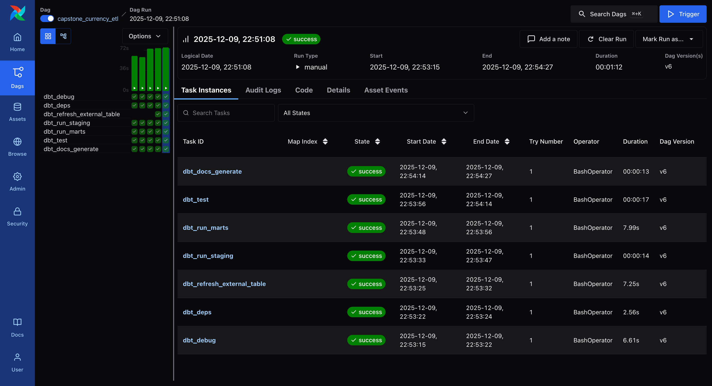
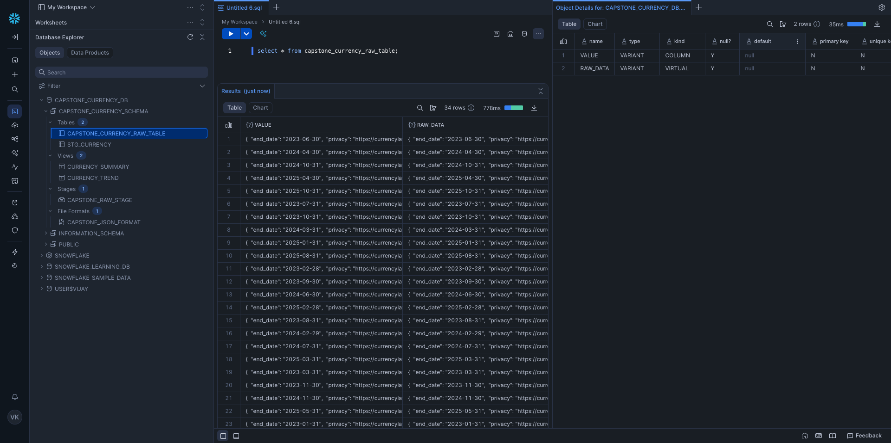
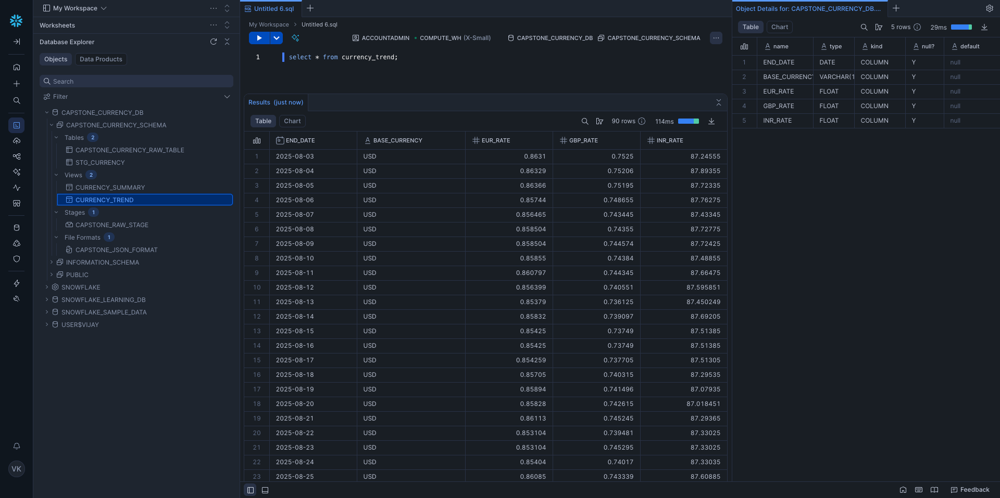
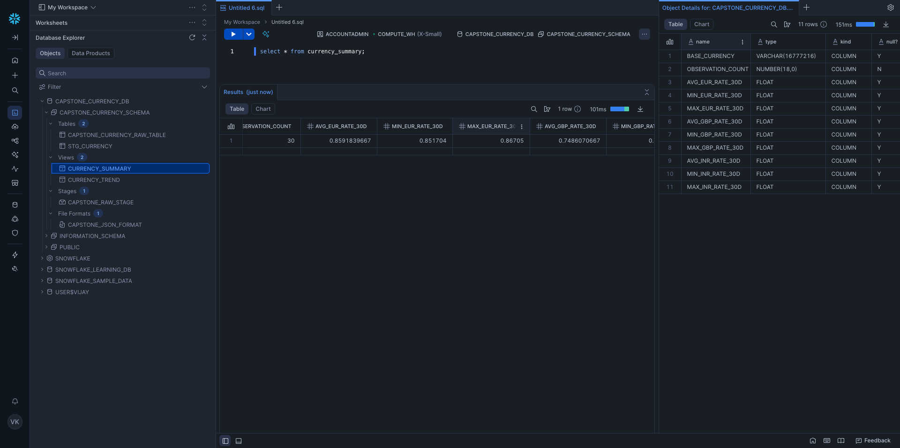

# **Capstone Currency ETL Overview**

The **[transform/](./transform/)** directory defines the **data transformation and orchestration layer** of the **Capstone Currency Data Pipeline**, combining:

* **dbt Core** for SQL-based data transformation and modeling in **Snowflake**, and
* **Apache Airflow** for orchestrating and scheduling dbt runs in a containerized environment.

This layer automates the flow from **raw JSON ingestion (via AWS Glue)** to **clean, analytics-ready models in Snowflake**, ensuring consistency, traceability, and reproducibility.

---

## Core Objective

Enable fully automated, version-controlled data transformations by:

1. Connecting securely to **Snowflake** (via `profiles.yml`).
2. Running **dbt transformations** on a schedule through Airflow DAGs.
3. Enforcing **data quality tests** on each run.
4. Managing environments with simple Docker Compose setup.
5. Delivering analytics-ready tables for dashboards and reports.

---

## Folder Structure

| Folder / File                | Purpose                                                            |
| ---------------------------- | ------------------------------------------------------------------ |
| **`capstone_currency_etl/`** | dbt project containing all SQL models, sources, and configuration. |
| **`dags/`**                  | Airflow DAG definitions for scheduling dbt transformations.        |
| **`config/`**                | Airflow configuration (connections, environment variables, etc.).  |
| **`logs/`**                  | Execution logs for Airflow tasks.                                  |
| **`plugins/`**               | Optional custom Airflow operators or hooks.                        |
| **`.env` / `.env_sample`**   | Environment variables for local Airflow and Snowflake setup.       |
| **`docker-compose.yaml`**    | Spins up a local Airflow + dbt orchestration environment.          |

---

## **Airflow Orchestration**

Airflow in this setup is used **exclusively to orchestrate dbt runs**.

### Typical DAG Flow

| Step                | Description                                                               |
| ------------------- | ------------------------------------------------------------------------- |
| **dbt_debug**       | Validates connection to Snowflake and confirms dbt project configuration. |
| **dbt_deps**        | Installs or updates dbt package dependencies.                             |
| **dbt_run_staging** | Runs staging-layer models to parse and flatten raw JSON data.             |
| **dbt_run_marts**   | Runs marts-layer models that aggregate and summarize data.                |
| **dbt_test**        | Executes schema and data quality tests on all models.                     |
| **dbt_docs**        | Generates model documentation and lineage (`dbt docs generate`).          |


### DAG ([currency_dbt_dag.py](./transform/dags/currency_dbt_dag.py))

```python
# capstone/airflow/dags/currency_dbt_dag.py
from datetime import datetime, timedelta
import os

from airflow import DAG
from airflow.operators.bash import BashOperator
from airflow.models import Variable

# CONFIGURATION
DBT_PROJECT_DIR = Variable.get("DBT_PROJECT_DIR", "/opt/airflow/capstone_currency_etl")
DBT_VENV_ACTIVATE = Variable.get("DBT_VENV_ACTIVATE", "")  # optional, usually empty in our docker setup
DBT_TARGET = Variable.get("DBT_TARGET", "dev")
SUMMARY_WINDOW_DAYS = Variable.get("SUMMARY_WINDOW_DAYS", "30")

# OPTIONAL: external table details for refresh
EXT_DB_NAME = Variable.get("EXT_TABLE_NAME", "CAPSTONE_CURRENCY_DB")
EXT_SCHEMA    = Variable.get("EXT_DB_NAME", "CAPSTONE_CURRENCY_SCHEMA")
EXT_TABLE_NAME     = Variable.get("EXT_SCHEMA", "CAPSTONE_CURRENCY_RAW_TABLE")

default_args = {
    "owner": "airflow",
    "depends_on_past": False,
    "retries": 1,
    "retry_delay": timedelta(minutes=5),
}

with DAG(
    dag_id="capstone_currency_etl",
    start_date=datetime(2025, 1, 1),
    schedule="0 2 * * *",  # daily at 02:00
    catchup=False,
    max_active_runs=1,
    default_args=default_args,
    tags=["dbt", "currency"],
) as dag:

    # optional: dbt debug
    dbt_debug = BashOperator(
        task_id="dbt_debug",
        bash_command=(
            f"cd {DBT_PROJECT_DIR} && "
            f"dbt debug --profiles-dir . --project-dir . --target {DBT_TARGET} || true"
        ),
        env=os.environ,
    )

    # install deps
    dbt_deps = BashOperator(
        task_id="dbt_deps",
        bash_command=f"cd {DBT_PROJECT_DIR} && dbt deps --profiles-dir . --project-dir .",
        env=os.environ,
    )

    # refresh external table using dbt run-operation
    dbt_refresh_external_table = BashOperator(
        task_id="dbt_refresh_external_table",
        bash_command=(
            f"cd {DBT_PROJECT_DIR} && "
            f"dbt run-operation refresh_external_table "
            f"--args '{{\"database\": \"{EXT_DB_NAME}\", "
            f"\"schema\": \"{EXT_SCHEMA}\", "
            f"\"table\": \"{EXT_TABLE_NAME}\", "
            f"\"complete\": false}}' "
            f"--profiles-dir . --project-dir . --target {DBT_TARGET}"
        ),
        env=os.environ,
    )

    # staging models
    dbt_run_staging = BashOperator(
        task_id="dbt_run_staging",
        bash_command=(
            f"cd {DBT_PROJECT_DIR} && "
            f"dbt run --profiles-dir . --project-dir . --target {DBT_TARGET} --select stg_currency+ "
            f"--vars '{{summary_window_days: {SUMMARY_WINDOW_DAYS}}}'"
        ),
        env=os.environ,
    )

    # marts
    dbt_run_marts = BashOperator(
        task_id="dbt_run_marts",
        bash_command=(
            f"cd {DBT_PROJECT_DIR} && "
            f"dbt run --profiles-dir . --project-dir . --target {DBT_TARGET} "
            f"--select currency_trend currency_summary "
            f"--vars '{{summary_window_days: {SUMMARY_WINDOW_DAYS}}}'"
        ),
        env=os.environ,
    )

    # tests
    dbt_test = BashOperator(
        task_id="dbt_test",
        bash_command=(
            f"cd {DBT_PROJECT_DIR} && "
            f"dbt test --profiles-dir . --project-dir . --target {DBT_TARGET} "
            f"--select stg_currency currency_trend currency_summary"
        ),
        env=os.environ,
    )

    # docs (optional)
    dbt_docs = BashOperator(
        task_id="dbt_docs_generate",
        bash_command=f"cd {DBT_PROJECT_DIR} && dbt docs generate --profiles-dir . --project-dir .",
        env=os.environ,
    )

    # ORDER OF EXECUTION
    dbt_debug >> dbt_deps >> dbt_refresh_external_table >> dbt_run_staging >> dbt_run_marts >> dbt_test >> dbt_docs
```

### Running Locally

1. **Configure Environment**

   ```bash
   cp .env_sample .env
   # Fill Snowflake credentials and Airflow variables
   ```

2. **Start Airflow**

   ```bash
   docker compose up -d
   ```

3. **Access Airflow UI**

   * URL: [http://localhost:8080](http://localhost:8080)
   * Default login: `airflow / airflow`

4. **Trigger dbt DAG**

   ```bash
   docker compose exec airflow-webserver airflow dags trigger currency_dbt_dag
   ```



---

## **DBT**

The **[`capstone_currency_etl/`](./transform//capstone_currency_etl/)** subdirectory contains the dbt project powering Snowflake transformations.
It follows a structured, modular approach: **sources → staging → marts**.

---

### Folder Structure

| Folder / File     | Purpose                                                                                                                         |
| ----------------- | ------------------------------------------------------------------------------------------------------------------------------- |
| `.user.yml`       | Developer-specific dbt CLI settings (optional overrides such as target schema or environment).                                  |
| `profiles.yml`    | Snowflake connection profile — defines account, user, warehouse, database, and role configuration used by dbt to connect.       |
| `dbt_project.yml` | Central dbt project configuration — defines model paths, materialization defaults, variable parameters, and naming conventions. |
| `models/`         | Core transformation logic — contains subfolders for sources, staging, and marts (documented below).                             |
| `macros/`         | Custom reusable SQL logic — includes Jinja macros for shared transformations, custom materializations, tests, and utility functions.                            |

---

### **[Macros](./transform/capstone_currency_etl/macros)**

| Macro Name                 | Purpose                                                                                                                                       | Key File(s)                         |
| -------------------------- | --------------------------------------------------------------------------------------------------------------------------------------------- | ----------------------------------- |
| **refresh_external_table** | Executes `ALTER EXTERNAL TABLE … REFRESH` to ensure Snowflake picks up newly added S3 files when auto-refresh is not enabled or not reliable. | `macros/refresh_external_table.sql` |


---

### **[Model Architecture](./transform/capstone_currency_etl/models)**

| Layer       | Purpose                                                                                | Key Files / Models                                                          |
| ----------- | -------------------------------------------------------------------------------------- | --------------------------------------------------------------------------- |
| **Sources** | Define upstream Snowflake tables created by AWS Glue; provide metadata and data tests. | `sources/sources.yml`                                                       |
| **Staging** | Parse and flatten raw JSON payloads into structured relational form.                   | `staging/stg_currency.sql`, `staging/stg_currency.yml`                      |
| **Marts**   | Create analytical views and aggregates for trend and summary reporting.                | `marts/currency_trend.sql`, `marts/currency_summary.sql`, `marts/marts.yml` |

---

### Configuration Files

####  **[profiles.yml](./transform/capstone_currency_etl/profiles_sample.yml)**

Defines the **connection settings** for Snowflake used by dbt.

Typical fields:

```yaml
capstone_currency:
  target: dev
  outputs:
    dev:
      type: snowflake
      account: "{{ env_var('SNOWFLAKE_ACCOUNT_NAME') }}"
      user: "{{ env_var('SNOWFLAKE_USER') }}"
      password: "{{ env_var('SNOWFLAKE_PASSWORD') }}"
      role: "{{ env_var('SNOWFLAKE_ROLE', 'ACCOUNTADMIN') }}"
      warehouse: "{{ env_var('SNOWFLAKE_WAREHOUSE', 'CAPSTONE_WH') }}"
      database: "{{ env_var('SNOWFLAKE_DATABASE', 'CAPSTONE_CURRENCY_DB') }}"
      schema: "{{ env_var('SNOWFLAKE_SCHEMA', 'CAPSTONE_CURRENCY_RAW') }}"
```

* Enables local and CI/CD runs without hardcoding credentials.
* Uses environment variables for secure connection management.

#### `dbt_project.yml`

Defines **project structure, model paths, and defaults**.

Example configuration areas:

* Model directories (`models/staging`, `models/marts`)
* Materialization settings (`staging`: table, `marts`: view)
* Variable defaults (e.g., `summary_window_days: 365`)
* Version control metadata (`name`, `profile`, `model-paths`)

####  `.user.yml`

Optional **developer personalization** file (ignored in production):

* Overrides schema or database targets for local testing.
* Supports per-user dbt runs without modifying shared settings.

---

### Transformation Flow

1. **Glue ingestion** → JSON files uploaded to S3 and loaded into Snowflake raw table.
2. **Source layer** (`sources.yml`) → declares that raw table as a dbt source.
3. **Staging layer** (`stg_currency.sql`) → parses JSON VARIANT data, flattens nested fields, and pivots currency rates.
4. **Marts layer** (`currency_trend`, `currency_summary`) → creates derived analytics views for trend and summary dashboards.
5. **Testing and documentation** → executed via `dbt test` and `dbt docs generate`.

---

### Key Highlights

* **Snowflake-native transformations** using `VARIANT` and `lateral flatten()`.
* **Automated documentation** via `dbt docs serve`.
* **Version-controlled configuration** enabling reproducible analytics builds.
* **Environment-agnostic connection setup** using `profiles.yml`.
* **Extensible and modular** design for new currencies or metrics.

---

### Typical Workflow

1. `dbt debug` → validate Snowflake connection.
2. `dbt run` → execute transformations (`sources → staging → marts`).
3. `dbt test` → validate data quality.
4. `dbt docs generate && dbt docs serve` → browse interactive documentation.

---

## [sources/](./transform/capstone_currency_etl/models/sources/)

**Purpose:** define and document the external raw data source used by dbt — the Snowflake table populated via AWS Glue ingestion.

**Files:**

* `sources.yml` — declares the raw source table and its metadata, mapping Snowflake database and schema from environment variables.

**Defined sources:**

| Source         | Table                         | Description                                                                                                                         |
| -------------- | ----------------------------- | ----------------------------------------------------------------------------------------------------------------------------------- |
| `RAW_CURRENCY` | `CAPSTONE_CURRENCY_RAW_TABLE` | Raw JSON payloads fetched from the currency API and stored in Snowflake. Each row represents one payload batch (typically monthly). |

**Columns:**

| Name       | Type      | Description                                                       |
| ---------- | --------- | ----------------------------------------------------------------- |
| `RAW_DATA` | `VARCHAR` | Optional raw JSON string payload.                                 |
| `VALUE`    | `VARIANT` | Parsed JSON object containing key-value pairs for currency rates. |

**Notes:**

* `database` and `schema` are dynamically set via environment variables (`SNOWFLAKE_DATABASE`, `SNOWFLAKE_SCHEMA`) for multi-environment support.
* This source is the foundation for the `stg_currency` staging model.



---

## [staging/](./transform/capstone_currency_etl/models/staging/)

**Purpose:** transform raw currency API payloads from JSON into structured, analytics-ready tables — one row per base currency and exchange date with pivoted rates.

**Files:**

* `stg_currency.sql` — parses, flattens, and normalizes JSON payloads from the raw source (`RAW_CURRENCY.CAPSTONE_CURRENCY_RAW_TABLE`) and pivots selected target currencies into columns.
* `stg_currency.yml` — documents the model and defines column-level tests (`not_null`).

**Transformation flow:**

1. **Extract:** select and parse `VALUE` or `RAW_DATA` JSON from the raw source.
2. **Parse:** derive `end_date`, `privacy`, `api_timestamp`, and `base_currency` from payload.
3. **Flatten:** expand nested JSON keys — first by date, then by target currency.
4. **Normalize:** derive `target_currency` (e.g., from `USDGBP` → `GBP`).
5. **Pivot:** reshape into columns (`eur_rate`, `gbp_rate`, `inr_rate`) per date.
6. **Output:** final structured table ordered by `end_date`.

**Typical models:**

* `stg_currency` — materialized as a `incremental`.

**Columns:**

| Name            | Description                                             | Tests      |
| --------------- | ------------------------------------------------------- | ---------- |
| `start_date`    | Start date for the exchange rate period (previous day). | `not_null` |
| `end_date`      | Date the exchange rate applies to.                      | `not_null` |
| `base_currency` | Base currency code (e.g., USD, EUR).                    | `not_null` |
| `eur_rate`      | Exchange rate to EUR.                                   | `not_null` |
| `gbp_rate`      | Exchange rate to GBP.                                   | `not_null` |
| `inr_rate`      | Exchange rate to INR.                                   | `not_null` |

**Notes:**

* Materialized as a **incremental** for reusability in marts.
* Serves as the foundation for downstream trend and summary models.
* Parsing and flattening are optimized for Snowflake’s `VARIANT` and `lateral flatten()` functions.


---

## [marts/](./transform/capstone_currency_etl/models/marts/)

**Purpose:** provide curated, analytics-ready views and aggregates for reporting — including daily exchange rate trends and base currency summaries.

**Files:**

* `currency_summary.sql` — summarizes currency exchange data over a configurable window (default: 365 days) with average, minimum, and maximum rates per base currency.
* `currency_trend.sql` — generates a 90-day trend view of daily exchange rates for each base currency.
* `currency_trend.yml` / `marts.yml` — define column metadata, model descriptions, and `not_null` tests.

**Models:**

| Model              | Materialization | Description                                                                 |
| ------------------ | --------------- | --------------------------------------------------------------------------- |
| `currency_summary` | `view`          | Summary statistics (avg/min/max) for each base currency over the past year. |
| `currency_trend`   | `view`          | Daily time-series of exchange rates for each base currency.                 |

**Columns (currency_trend):**

| Name            | Description                     | Tests      |
| --------------- | ------------------------------- | ---------- |
| `end_date`      | Date for which rates apply.     | `not_null` |
| `base_currency` | Base currency (USD, EUR, etc.). | `not_null` |
| `eur_rate`      | Daily exchange rate to EUR.     | `not_null` |
| `gbp_rate`      | Daily exchange rate to GBP.     | `not_null` |
| `inr_rate`      | Daily exchange rate to INR.     | `not_null` |



**Columns (currency_summary):**

| Name                                                       | Description                                    |
| ---------------------------------------------------------- | ---------------------------------------------- |
| `base_currency`                                            | Base currency code aggregated.                 |
| `observation_count`                                        | Number of rate observations within the window. |
| `avg_eur_rate_30d`, `min_eur_rate_30d`, `max_eur_rate_30d` | Aggregated EUR rate metrics.                   |
| `avg_gbp_rate_30d`, `min_gbp_rate_30d`, `max_gbp_rate_30d` | Aggregated GBP rate metrics.                   |
| `avg_inr_rate_30d`, `min_inr_rate_30d`, `max_inr_rate_30d` | Aggregated INR rate metrics.                   |




**Notes:**

* Both models depend on the staging layer (`stg_currency`).
* Time window (`summary_window_days`) can be adjusted via dbt variables.
* `currency_trend` feeds directly into dashboards or BI visualizations.
* All marts are materialized as **views** for lightweight querying and freshness.
---
**[Back](./README.md)**